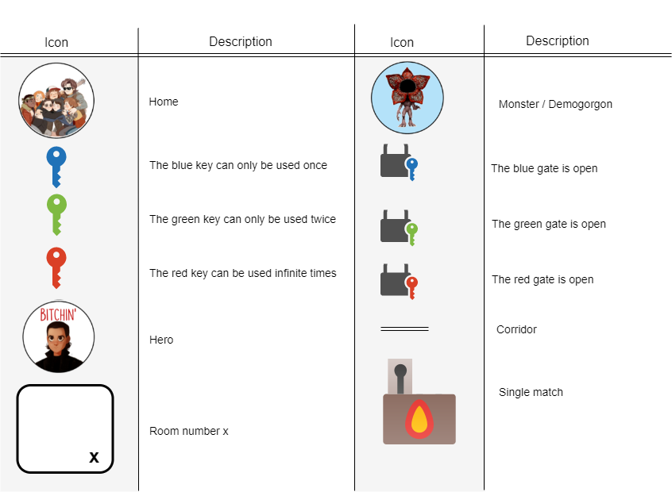
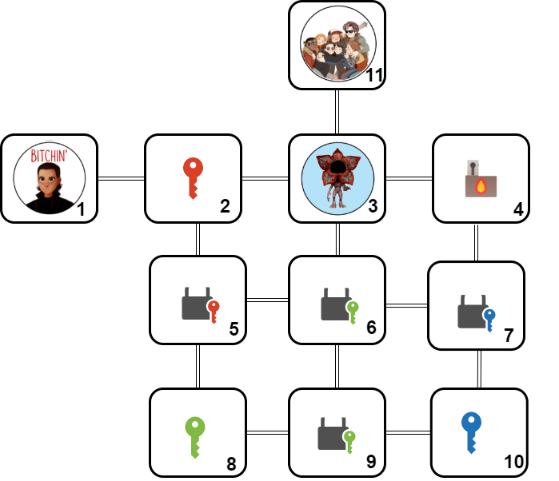
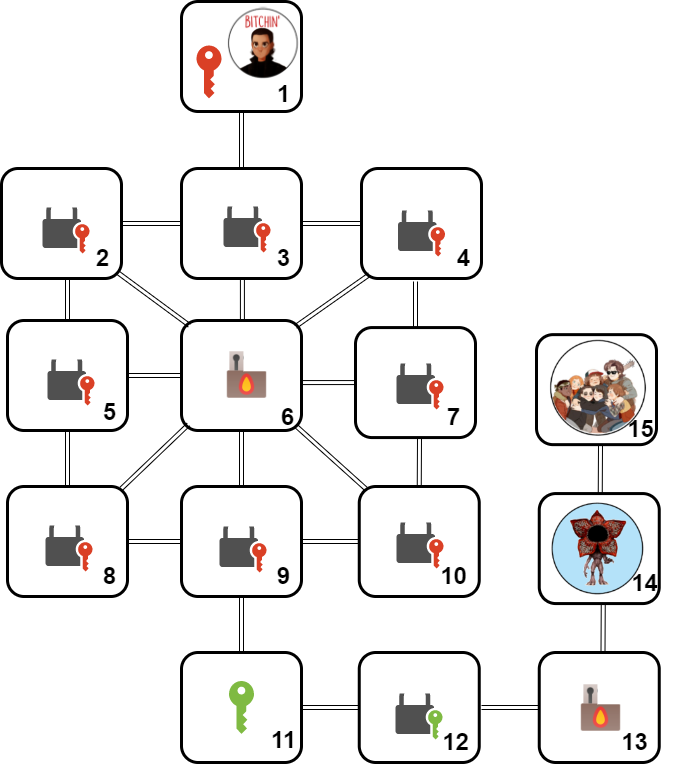
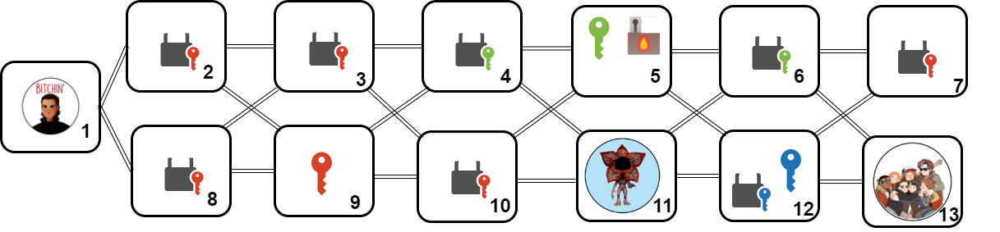

# AI Planning for Autonomy - Project 2 - PDDL modelling 

## Task

**Your task** is to read the description of the the domain below and encode the three planning problem instances specified filling the template files provided in this repository in the folder [pddl_template](pddl_template). See more information in the [Deliverables & Rubric](#deliverables--rubric) section.

## The Domain - Real Player Game

 *Help the hero to get out of a maze known as the UpsideDown!*
 
 A hero woke up in the UpsideDown (perhaps the party last night went wrong...), and wants to return home to Melborune. The UpsideDown is a maze full of Demogorgons (monsters) and gates. The Hero needs your help to close all the gates in order to make sure monsters will not go back to Melbourne, and then get back home. I.e. The hero has to get home and close all gates.  Here are basic facts for the UpsideDown domain:
- The UpsideDown contains rooms that are **connected** by corridors (UpsideDown can thus be represented by an undirected graph),
- each room can be **empty**, or can have a **Demogorgon**, a **key** or/and a **match** in it,
- one of the empty rooms is **home**: where the hero really wants to be.

The hero is lucky since she/he has full knowledge about the UpsideDown. But not that lucky – just after the hero leaves each room she visits, the room is **invigilated** by **Vecna** (the bad guy) and cannot be visited again.

The hero can perform the following actions – but only if s/he is alive!
- The hero can **move** to an adjacent room (connected by a corridor) that has not been invigilated (i.e., the hero has not already visited the room). If the hero moves into a room with a monster, she needs to be holding a match.
- **Pickup** a match or a key if present in the room the hero is currently in and the hero is empty handed
- **Drop** a match or a key, it will become present in the room, and the hero will have the hands free to pickup a key or a match.
- **Strike a match**. The hero can move into a room with a monster **but**, before leaving the room, it needs to strike a match, as the monster will eat the hero otherwise. For some reason, monsters are affraid of fire. The fire of a match lasts only until the hero moves. I.e. if a match is on fire, once the character moves, the match will go off. Once the match has been used, it doesn't disappear, you have to drop it if you want to pick up another object.
- **Close a Gate** – if there is a gate in an adjacent room to the current room where the hero is in, the hero is holding the correct color key, and the key has still some uses available, then the hero can close the gate. The hero can move through rooms with closed gates as long as she hasn't moved through that room yet. Once a gate is closed, the counter of how many times the key can be used will be decreased. Once a key has been used to completion, it doesn't dissapear, the character needs to drop it if she wants to use another key or pickup another match. Keys can be:
    - Single-use keys, can be used only once.
    - Double-use Keys, can be used twice.
    - Master Keys, can be used infinitely often.

**Important:** We recommend reading the description carefully several times to make sure you fully understand it before starting coding in PDDL.

## Legend

The problems you need to implement are defined by the following graphs using the legend below, Good luck![^1]

 

[^1]: Icons acknowledgement: https://www.pngkey.com/maxpic/u2q8w7a9e6o0q8r5/

### Problem 1

### Problem 2

### Problem 3

<!-- # Planimated Example Solution
 -->
